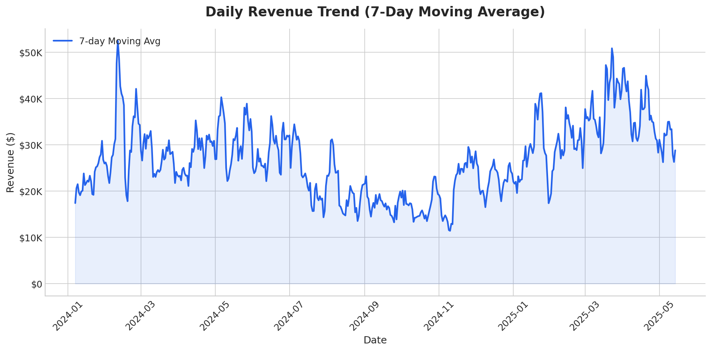
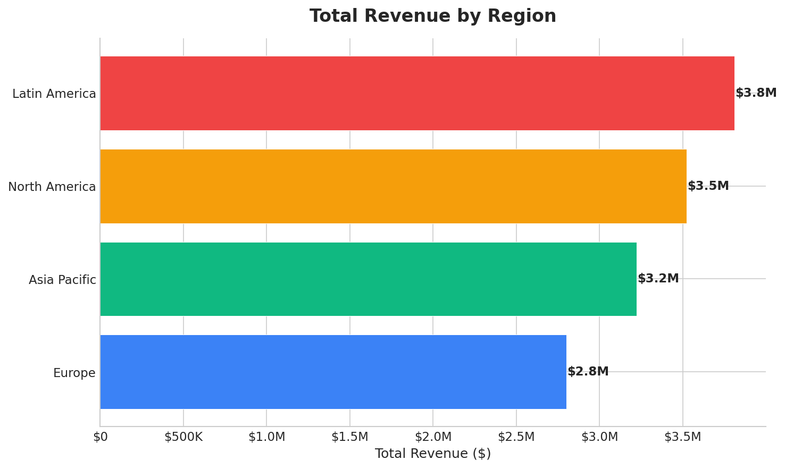
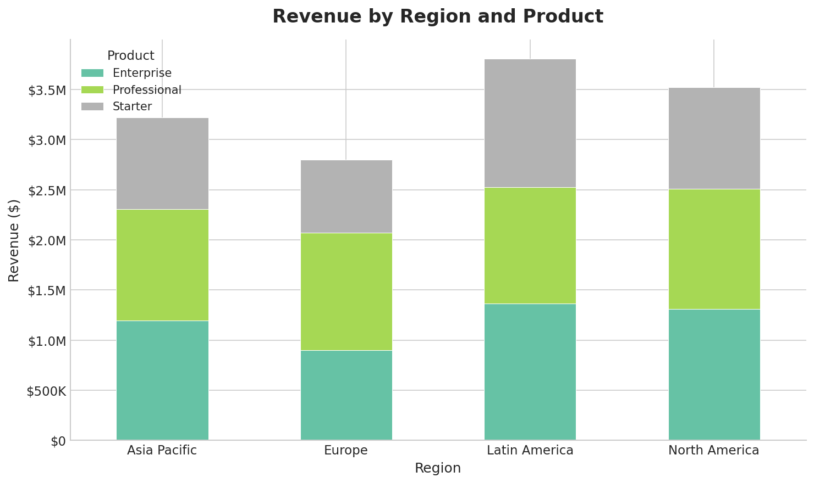
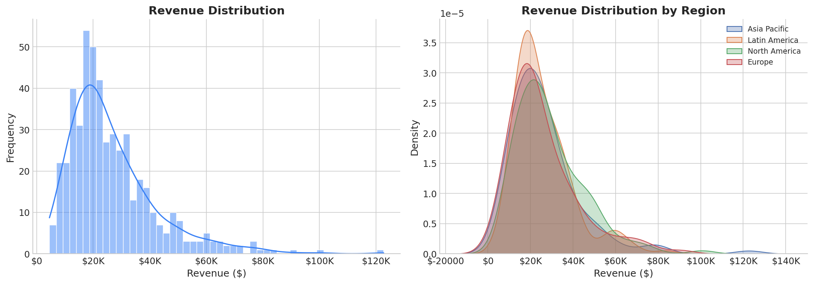

# MODULE-06a: VISUALIZATION — BASIC CHARTS

## Why Visualization Matters

> "The single most important thing in data analysis is to **look at your data**." — John Tukey

Visualization helps you:
- Spot patterns, trends, and outliers instantly
- Communicate findings to stakeholders
- Validate assumptions before modeling
- Create production-grade reports

---

## Chart Selection Guide

| Goal | Chart Type | When to Use |
|------|-----------|-------------|
| Show trend over time | Line chart | Continuous time series |
| Compare categories | Bar chart | Few categories (<10) |
| Show distribution | Histogram/KDE | Understanding spread |
| Show relationship | Scatter plot | Two numerical variables |
| Show composition | Stacked bar/Pie | Parts of a whole |
| Show comparison | Box plot | Distributions across groups |
| Show correlation | Heatmap | Many variable relationships |
| Show multiple metrics | Dashboard | Executive summary |

---

## 1. Setup and Styling

```python
import pandas as pd
import numpy as np
import matplotlib.pyplot as plt
import seaborn as sns

# Set professional style
plt.style.use('seaborn-v0_8-whitegrid')
sns.set_palette("deep")

# Global styling parameters
plt.rcParams.update({
    'font.size': 11,           # Base font size
    'axes.titlesize': 14,      # Title font size
    'axes.labelsize': 12,      # Axis label font size
    'figure.dpi': 150,         # Screen resolution
    'axes.spines.top': False,  # Remove top border
    'axes.spines.right': False,# Remove right border
})

# Why these settings?
# - seaborn style: Clean, professional look
# - No top/right spines: Reduces chart junk (Tufte's principle)
# - DPI 150: Sharp on screens and print
```

---

## 2. Line Charts — Trends Over Time

```python
# Sample time series
np.random.seed(42)
sales = pd.DataFrame({
    'date': pd.date_range('2024-01-01', periods=365, freq='D'),
    'revenue': np.random.lognormal(mean=10, sigma=0.5, size=365)
})
sales['revenue'] *= 1 + 0.3 * np.sin(2 * np.pi * sales['date'].dt.dayofyear / 365)

# --- BASIC LINE CHART ---
fig, ax = plt.subplots(figsize=(12, 6))
daily = sales.groupby('date')['revenue'].sum()
ax.plot(daily.index, daily.values, color='#2563eb', linewidth=1.5)
ax.set_title('Daily Revenue', fontsize=16, fontweight='bold', pad=15)
ax.set_xlabel('Date')
ax.set_ylabel('Revenue ($)')
plt.xticks(rotation=45)
plt.tight_layout()
plt.savefig('charts/line_basic.png', bbox_inches='tight')
plt.close()

# --- LINE WITH MOVING AVERAGE ---
fig, ax = plt.subplots(figsize=(12, 6))
# Raw daily data (faint)
ax.plot(daily.index, daily.values, color='#94a3b8', linewidth=0.8, alpha=0.5, label='Daily')
# 7-day moving average (prominent)
ma7 = daily.rolling(7).mean()
ax.plot(ma7.index, ma7.values, color='#2563eb', linewidth=2.5, label='7-Day MA')
# Fill under curve
ax.fill_between(ma7.index, ma7.values, alpha=0.1, color='#2563eb')
ax.set_title('Daily Revenue Trend (7-Day Moving Average)', fontsize=16, fontweight='bold', pad=15)
ax.set_xlabel('Date')
ax.set_ylabel('Revenue ($)')
ax.legend(loc='upper left')
plt.xticks(rotation=45)
plt.tight_layout()
plt.savefig('charts/line_with_ma.png', bbox_inches='tight')
plt.close()
```

**See generated chart:**


---

## 3. Bar Charts — Comparing Categories

```python
# --- SIMPLE BAR CHART ---
fig, ax = plt.subplots(figsize=(10, 6))
region_totals = sales.groupby('region')['revenue'].sum().sort_values(ascending=True)
colors = ['#3b82f6', '#10b981', '#f59e0b', '#ef4444']
bars = ax.barh(region_totals.index, region_totals.values, color=colors, edgecolor='white')
# Add value labels
for bar, val in zip(bars, region_totals.values):
    ax.text(bar.get_width() + 1000, bar.get_y() + bar.get_height()/2,
            f'${val/1e6:.1f}M', va='center', fontweight='bold')
ax.set_title('Total Revenue by Region', fontsize=16, fontweight='bold', pad=15)
ax.set_xlabel('Total Revenue ($)')
plt.tight_layout()
plt.savefig('charts/bar_horizontal.png', bbox_inches='tight')
plt.close()

# --- GROUPED BAR CHART ---
fig, ax = plt.subplots(figsize=(10, 6))
pivot = sales.groupby(['region', 'product'])['revenue'].sum().unstack()
pivot.plot(kind='bar', ax=ax, colormap='Set2', edgecolor='white', width=0.8)
ax.set_title('Revenue by Region and Product', fontsize=16, fontweight='bold', pad=15)
ax.set_xlabel('Region')
ax.set_ylabel('Revenue ($)')
ax.legend(title='Product')
plt.xticks(rotation=0)
plt.tight_layout()
plt.savefig('charts/bar_grouped.png', bbox_inches='tight')
plt.close()

# --- STACKED BAR CHART ---
fig, ax = plt.subplots(figsize=(10, 6))
pivot.plot(kind='bar', stacked=True, ax=ax, colormap='Set2', edgecolor='white')
ax.set_title('Revenue by Region and Product (Stacked)', fontsize=16, fontweight='bold', pad=15)
ax.set_xlabel('Region')
ax.set_ylabel('Revenue ($)')
ax.legend(title='Product')
plt.xticks(rotation=0)
plt.tight_layout()
plt.savefig('charts/bar_stacked.png', bbox_inches='tight')
plt.close()
```

**See generated charts:**



---

## 4. Histograms and Distribution Plots

```python
# --- HISTOGRAM WITH KDE ---
fig, axes = plt.subplots(1, 2, figsize=(14, 5))

# Left: Histogram
sns.histplot(sales['revenue'], bins=50, kde=True, ax=axes[0], color='#3b82f6', edgecolor='white')
axes[0].set_title('Revenue Distribution', fontsize=14, fontweight='bold')
axes[0].set_xlabel('Revenue ($)')
axes[0].set_ylabel('Frequency')

# Right: KDE by group
for region in sales['region'].unique():
    data = sales[sales['region'] == region]['revenue']
    sns.kdeplot(data, ax=axes[1], label=region, fill=True, alpha=0.3)
axes[1].set_title('Revenue Distribution by Region', fontsize=14, fontweight='bold')
axes[1].set_xlabel('Revenue ($)')
axes[1].legend()

plt.tight_layout()
plt.savefig('charts/hist_kde.png', bbox_inches='tight')
plt.close()

# Why histogram vs KDE?
# Histogram: Shows actual count distribution (good for discrete bins)
# KDE: Smoothed density estimate (good for comparing distributions)
# Use both together for complete picture
```

**See generated chart:**


---

## Quick Reference

| Chart | Code | Best For |
|-------|------|----------|
| Line | `ax.plot(x, y)` | Trends over time |
| Bar | `ax.bar(x, y)` or `df.plot.bar()` | Category comparison |
| Histogram | `sns.histplot(data)` | Distribution |
| KDE | `sns.kdeplot(data)` | Smoothed distribution |

---

## Next Steps

- **Module 06b:** Scatter plots, box plots, heatmaps, dashboards
- **Module 07a:** Export to CSV and Excel

