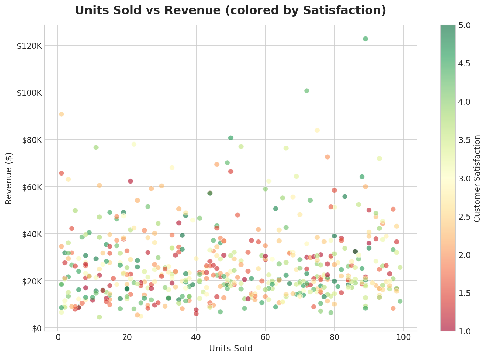
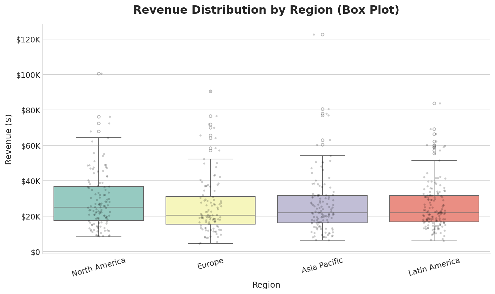
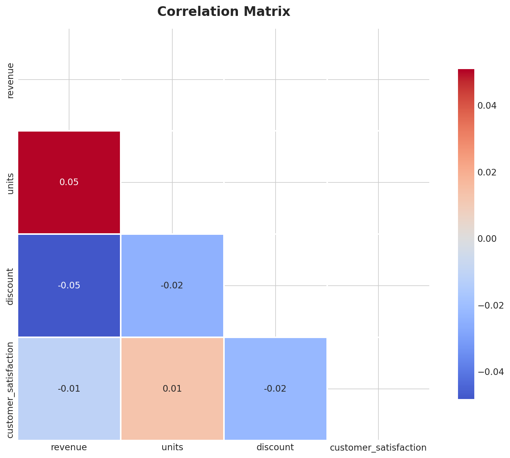
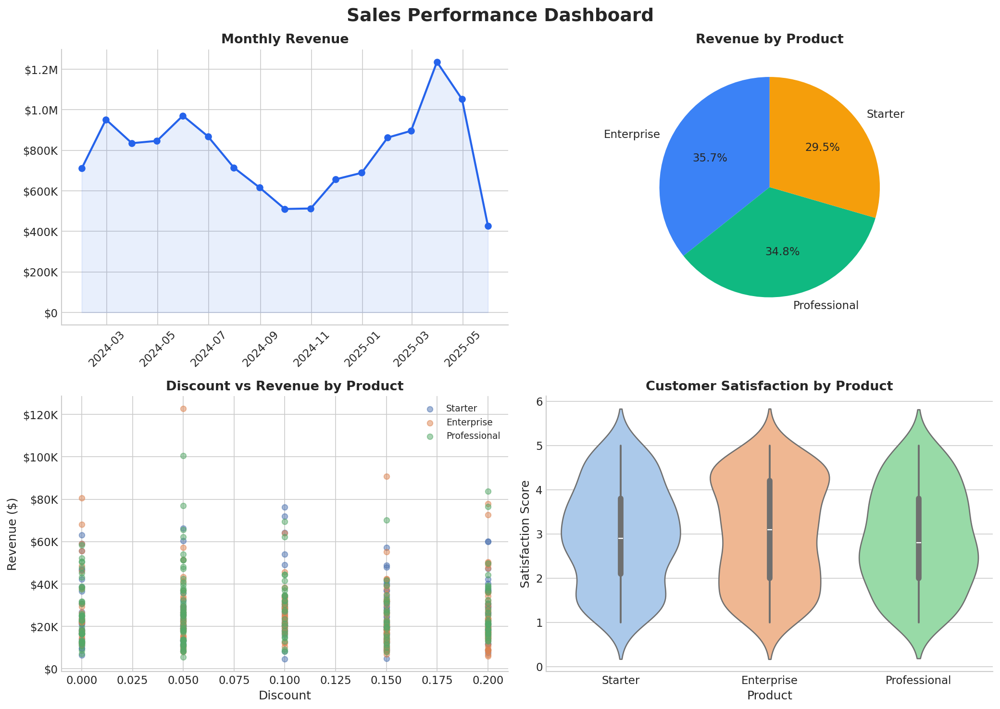

# MODULE-06b: VISUALIZATION — ADVANCED CHARTS AND DASHBOARDS

---

## 5. Scatter Plots — Relationships

```python
# --- BASIC SCATTER ---
fig, ax = plt.subplots(figsize=(10, 7))
ax.scatter(sales['units'], sales['revenue'], alpha=0.6, s=50, edgecolors='white', linewidth=0.5)
ax.set_title('Units vs Revenue', fontsize=16, fontweight='bold', pad=15)
ax.set_xlabel('Units Sold')
ax.set_ylabel('Revenue ($)')
plt.tight_layout()
plt.savefig('charts/scatter_basic.png', bbox_inches='tight')
plt.close()

# --- SCATTER WITH COLOR MAPPING ---
fig, ax = plt.subplots(figsize=(10, 7))
scatter = ax.scatter(
    sales['units'], sales['revenue'],
    c=sales['customer_satisfaction'],  # Color by satisfaction
    cmap='RdYlGn',                      # Red-Yellow-Green colormap
    alpha=0.6, s=50, edgecolors='white', linewidth=0.5
)
plt.colorbar(scatter, ax=ax, label='Customer Satisfaction')
ax.set_title('Units vs Revenue (colored by Satisfaction)', fontsize=16, fontweight='bold', pad=15)
ax.set_xlabel('Units Sold')
ax.set_ylabel('Revenue ($)')
plt.tight_layout()
plt.savefig('charts/scatter_colored.png', bbox_inches='tight')
plt.close()

# --- SCATTER WITH TREND LINE ---
fig, ax = plt.subplots(figsize=(10, 7))
sns.regplot(x='units', y='revenue', data=sales, ax=ax, scatter_kws={'alpha':0.5, 's':30},
            line_kws={'color': 'red', 'linewidth': 2})
ax.set_title('Units vs Revenue (with Regression Line)', fontsize=16, fontweight='bold', pad=15)
plt.tight_layout()
plt.savefig('charts/scatter_regression.png', bbox_inches='tight')
plt.close()
```

**See generated chart:**


---

## 6. Box Plots — Distribution Comparison

```python
# --- BASIC BOX PLOT ---
fig, ax = plt.subplots(figsize=(10, 6))
sns.boxplot(data=sales, x='region', y='revenue', ax=ax, palette='Set3',
            flierprops=dict(marker='o', markersize=4, alpha=0.5))
# Add strip plot for individual points
sns.stripplot(data=sales, x='region', y='revenue', ax=ax, color='black', alpha=0.2, size=3)
ax.set_title('Revenue Distribution by Region', fontsize=16, fontweight='bold', pad=15)
ax.set_xlabel('Region')
ax.set_ylabel('Revenue ($)')
plt.xticks(rotation=15)
plt.tight_layout()
plt.savefig('charts/boxplot.png', bbox_inches='tight')
plt.close()

# --- VIOLIN PLOT (box + KDE) ---
fig, ax = plt.subplots(figsize=(10, 6))
sns.violinplot(data=sales, x='region', y='revenue', ax=ax, palette='pastel', inner='quartile', hue='region', legend=False)
ax.set_title('Revenue Distribution by Region (Violin Plot)', fontsize=16, fontweight='bold', pad=15)
plt.tight_layout()
plt.savefig('charts/violin.png', bbox_inches='tight')
plt.close()

# Why box plot vs violin?
# Box plot: Shows median, quartiles, outliers (compact)
# Violin plot: Shows full distribution shape (more informative)
# Use violin when distribution shape matters
```

**See generated chart:**


---

## 7. Heatmaps — Correlation and Patterns

```python
# --- CORRELATION HEATMAP ---
fig, ax = plt.subplots(figsize=(10, 8))
corr_cols = ['revenue', 'units', 'discount', 'customer_satisfaction']
corr_matrix = sales[corr_cols].corr()

# Mask upper triangle for cleaner look
mask = np.triu(np.ones_like(corr_matrix, dtype=bool))

sns.heatmap(
    corr_matrix,
    mask=mask,
    annot=True,          # Show correlation values
    fmt='.2f',           # Format to 2 decimal places
    cmap='coolwarm',     # Blue (negative) to Red (positive)
    center=0,            # Center colormap at 0
    square=True,         # Square cells
    linewidths=1,        # Cell borders
    cbar_kws={'shrink': 0.8},
    ax=ax,
    annot_kws={'fontsize': 11}
)
ax.set_title('Correlation Matrix', fontsize=16, fontweight='bold', pad=15)
plt.tight_layout()
plt.savefig('charts/heatmap.png', bbox_inches='tight')
plt.close()
```

**See generated chart:**


---

## 8. Multi-Panel Dashboards

```python
fig, axes = plt.subplots(2, 2, figsize=(14, 10))
fig.suptitle('Sales Performance Dashboard', fontsize=18, fontweight='bold', y=0.98)

# Panel 1: Monthly revenue trend
monthly = sales.set_index('date')['revenue'].resample('ME').sum()
axes[0, 0].plot(monthly.index, monthly.values, color='#2563eb', linewidth=2, marker='o')
axes[0, 0].fill_between(monthly.index, monthly.values, alpha=0.1, color='#2563eb')
axes[0, 0].set_title('Monthly Revenue', fontsize=13, fontweight='bold')
axes[0, 0].tick_params(axis='x', rotation=45)

# Panel 2: Product mix pie chart
product_mix = sales.groupby('product')['revenue'].sum()
axes[0, 1].pie(product_mix.values, labels=product_mix.index, autopct='%1.1f%%',
               colors=['#3b82f6', '#10b981', '#f59e0b'], startangle=90, textprops={'fontsize': 11})
axes[0, 1].set_title('Revenue by Product', fontsize=13, fontweight='bold')

# Panel 3: Discount vs Revenue by product
for prod in sales['product'].unique():
    data = sales[sales['product'] == prod]
    axes[1, 0].scatter(data['discount'], data['revenue'], alpha=0.5, label=prod, s=30)
axes[1, 0].set_title('Discount vs Revenue by Product', fontsize=13, fontweight='bold')
axes[1, 0].set_xlabel('Discount')
axes[1, 0].set_ylabel('Revenue ($)')
axes[1, 0].legend(fontsize=9)

# Panel 4: Satisfaction by product
sns.violinplot(data=sales, x='product', y='customer_satisfaction', ax=axes[1, 1], hue='product', palette='pastel', legend=False)
axes[1, 1].set_title('Customer Satisfaction by Product', fontsize=13, fontweight='bold')
axes[1, 1].set_xlabel('Product')
axes[1, 1].set_ylabel('Satisfaction Score')

plt.tight_layout()
plt.savefig('charts/dashboard.png', dpi=150, bbox_inches='tight')
plt.close()
```

**See generated chart:**


---

## 9. Chart Customization — Production Grade

```python
# --- CUSTOM FORMATTERS ---
from matplotlib.ticker import FuncFormatter

def currency_fmt(x, pos):
    """Format numbers as currency."""
    if x >= 1e6: return f'${x/1e6:.1f}M'
    elif x >= 1e3: return f'${x/1e3:.0f}K'
    return f'${x:.0f}'

def pct_fmt(x, pos):
    """Format numbers as percentage."""
    return f'{x*100:.0f}%'

# Apply formatter
ax.yaxis.set_major_formatter(FuncFormatter(currency_fmt))
ax.xaxis.set_major_formatter(FuncFormatter(pct_fmt))

# --- CUSTOM COLORS AND COLORMAPS ---
# Sequential (ordered data)
sns.color_palette("Blues", 5)
sns.color_palette("YlOrRd", 5)

# Diverging (positive/negative)
sns.color_palette("coolwarm", 5)
sns.color_palette("RdBu_r", 5)

# Categorical (unordered categories)
sns.color_palette("Set1", 5)
sns.color_palette("Set2", 5)
sns.color_palette("Set3", 5)

# --- ADDING ANNOTATIONS ---
ax.annotate('Peak', xy=(peak_date, peak_value),
            xytext=(peak_date + 30, peak_value + 10000),
            arrowprops=dict(arrowstyle='->', color='red'),
            fontsize=12, color='red')
```

---

## 10. Saving Charts for Production

```python
# --- SAVE FOR WEB ---
plt.savefig('chart_web.png', dpi=150, bbox_inches='tight')
# dpi=150: Good for screens
# bbox_inches='tight': Remove extra whitespace

# --- SAVE FOR PRINT ---
plt.savefig('chart_print.pdf', dpi=300, bbox_inches='tight')
# dpi=300: Print quality
# .pdf: Vector format (scales without quality loss)

# --- SAVE FOR PRESENTATION ---
plt.savefig('chart_ppt.png', dpi=200, bbox_inches='tight', transparent=False)
# Higher DPI for projection

# --- SAVE MULTIPLE FORMATS ---
for fmt in ['png', 'pdf', 'svg']:
    plt.savefig(f'chart.{fmt}', dpi=300 if fmt == 'png' else None, bbox_inches='tight')
```

---

## Quick Reference

| Chart | Code | Best For |
|-------|------|----------|
| Scatter | `ax.scatter(x, y)` | Relationship between 2 vars |
| Box plot | `sns.boxplot(x, y, data)` | Distribution by group |
| Heatmap | `sns.heatmap(data)` | Correlation/pattern matrix |
| Pie | `ax.pie(sizes)` | Parts of a whole |
| Dashboard | `plt.subplots(2, 2)` | Multi-metric overview |

---

## Next Steps

- **Module 07a:** Export to CSV and Excel
- **Module 08a:** Performance optimization

